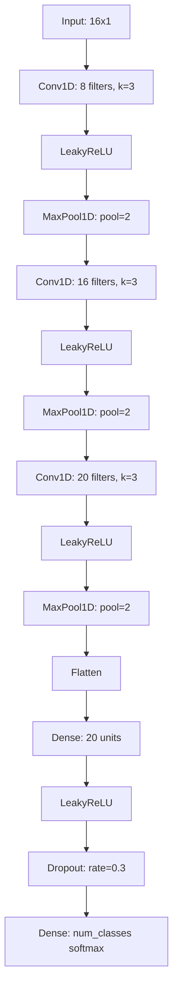

# Model Architecture

```mermaid
graph TD
    A[Input: 16x1] --> B[Conv1D: 8 filters, k=3]
    B --> C[LeakyReLU]
    C --> D[MaxPool1D: pool=2]
    D --> E[Conv1D: 16 filters, k=3]
    E --> F[LeakyReLU]
    F --> G[MaxPool1D: pool=2]
    G --> H[Conv1D: 20 filters, k=3]
    H --> I[LeakyReLU]
    I --> J[MaxPool1D: pool=2]
    J --> K[Flatten]
    K --> L[Dense: 20 units]
    L --> M[LeakyReLU]
    M --> N[Dropout: rate=0.3]
    N --> O[Dense: num_classes softmax]
```